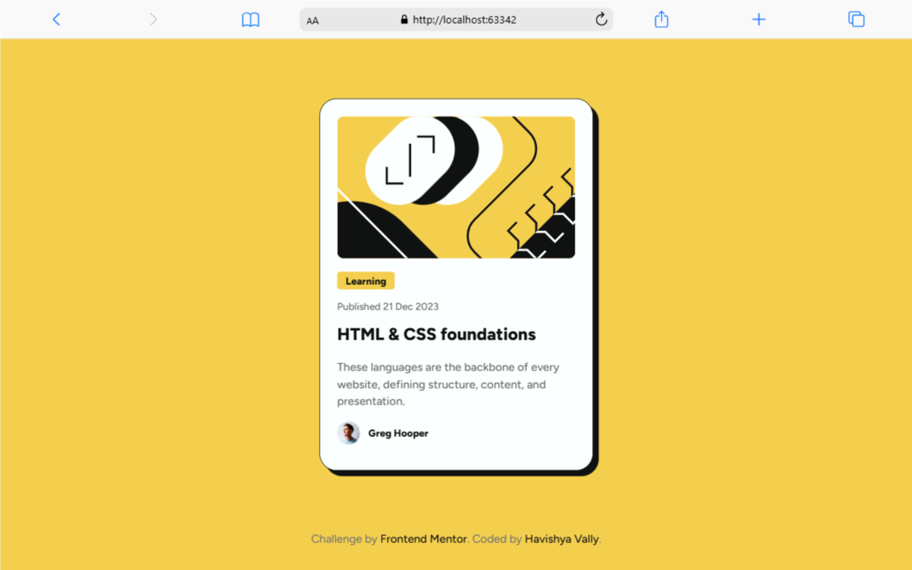
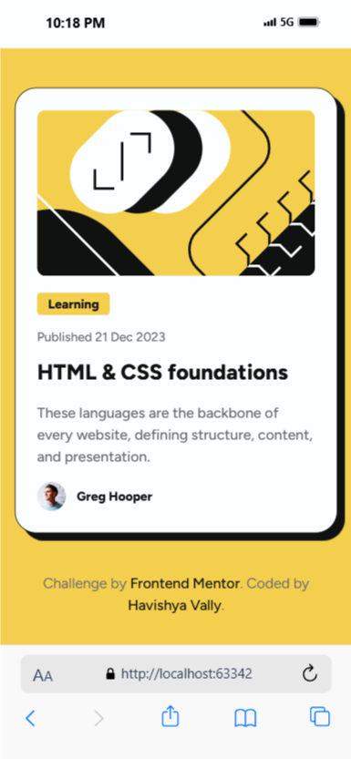

# 🔗 Frontend Mentor - Blog Preview Card

<div align="center">

  <div style="display: flex; justify-content: center; align-items: flex-end; gap: 20px; margin-bottom: 20px;">
    
    
  </div>
  <br>

### [Live Demo](https://fm-newbie-blog-preview-card.vercel.app) | [Portfolio](YOUR_REPO_URL_HERE)

  <p>A blog preview card component challenge from <a href="https://www.frontendmentor.io/challenges/blog-preview-card-ckPaj01IcS">Frontend Mentor</a>.</p>

  <!-- Badges -->
  
  
  
  

</div>

<br>

---

### 📄 Project Overview

This is my solution to the [Blog Preview Card challenge on Frontend Mentor](https://www.frontendmentor.io/challenges/blog-preview-card-ckPaj01IcS). The challenge was to build a semantic, accessible, and responsive card component.

The design relies heavily on strong typography and a distinct "physical" look created by borders and solid shadows, which was the main focus of my CSS implementation.

---
### 🚀 Features

- **Solid Box Shadows:** Implemented a "hard" shadow effect to mimic the design's brutalist aesthetic.
- **Semantic HTML5:** Built using meaningful tags (`<article>`, `<figure>`, `<time>`, `<header>`) rather than generic divs.
- **Responsive Layout:** The card is fluid on mobile but locks to a fixed width (`384px`) on desktop screens.
- **CSS Variables:** Used `:root` to store colors like `--color-primary` (#f4d04e) for easy theme management.
- **Custom Typography:** Integrated the "Figtree" font via `@font-face` for pixel-perfect design accuracy.
---
### 💡 Key Learnings: Mastering Box Shadow

The biggest learning curve in this project was understanding how to manipulate the `box-shadow` property to create a **solid, sharp shadow** rather than a blurry one.

I learned that the third value in the `box-shadow` property represents the **blur radius**. By setting this to `0`, I removed the softness completely.

I combined this with an X and Y offset of `8px` and a solid black border to create the illusion that the card is a physical object sitting on top of the background.

Here is the exact code snippet that achieves this effect:

```css
article {
    background-color: white;
    padding: 24px;
    border-radius: 24px;
    
    /* The Border defines the edge */
    border: 1px solid rgb(17, 17, 17);

    /* 
       box-shadow: [offset-x] [offset-y] [blur-radius] [spread] [color]; 
       
       1. 8px X-offset pushes shadow right
       2. 8px Y-offset pushes shadow down
       3. 1px (or 0) blur keeps it sharp/hard
    */
    box-shadow: 8px 8px 1px 0 rgba(17,17,17,1);
}
```
---

### 👤 Author

- LinkedIn - [@HavishyaVally](https://www.linkedin.com/in/havishyavally/)
- Frontend Mentor - [@HavishyaVally](https://www.frontendmentor.io/profile/HavishyaVally)
- GitHub - [HavishyaVally](https://github.com/HavishyaVally)


---
