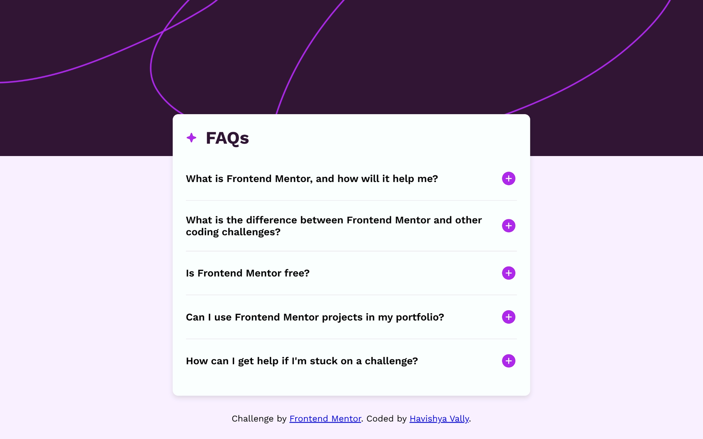
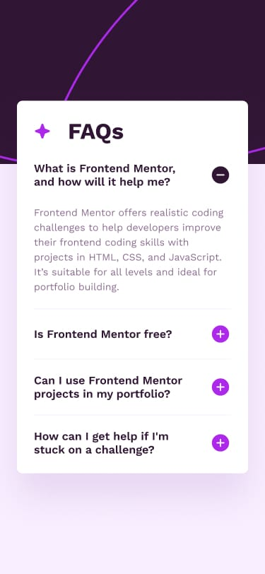

# &lt;/&gt; Frontend Mentor - FAQ Accordion

  

    <!-- Replace with your specific image paths, usually located in /design folder -->
    

[//]: # (    )
  

<h3>
  <a href="https://faq-accord-xi.vercel.app">Live Demo</a> 
</h3>

  A FAQ accordion project from <a href="https://www.frontendmentor.io/challenges/faq-accordion-wyfFdeBwBz">Frontend Mentor</a>.

  
  
  
  
  

---

## 📝 Project Overview

This is my solution to the [FAQ accordion component challenge on Frontend Mentor](https://www.frontendmentor.io/challenges/faq-accordion-card-XlyjD0Oam). The task was to build an interactive FAQ component, a mobile-first responsive layout, and accessible interactions.

---
## 🚀 Features

- **Accordion Functionality**: FAQ answers can be toggled open and closed independently.
- **Icon Toggle**: Plus/minus icon changes as each FAQ is expanded or collapsed.
- **Semantic & Accessible HTML**: Simple markup structure for easy navigation.
- **Responsive Design**: Built with mobile-first CSS and fluid layouts using Flexbox.
- **Optimized Images:** Responsive `<picture>` elements for background patterns.
---
## 📦 Built With

- Semantic HTML5
- CSS3 (Flexbox, Grid, Media Queries)
- Vanilla JavaScript

---

## 🧑‍🎓 Credits

Challenge by [Frontend Mentor](https://www.frontendmentor.io/).  
Coded by [Havishya Vally](..).

---
